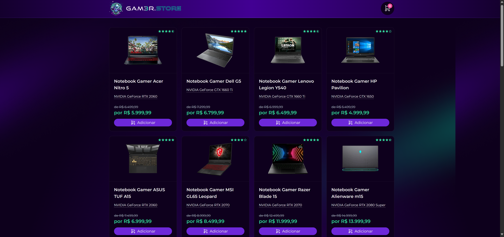

# Gam3r.store
Aplicação Gam3r.store feito durante a trilha intermediária da Formação DEV

<h1 align="center">
  
</h1>


<br>

## 💻 Tecnologias Utilizadas nesse Projeto
<div style="display: inline_block">
  
  
  
  
  
  
  
  
  
  

</div>

<br>

## Especificações
- Node: 20.17.0
- Pacote de Gerenciamento de Dependências: YARN
- Framework: TurboRepo + NestJS + NextJS e React + Expo e React Native
- Hospedagem Frontend: Vercel
- Hospedagem Backend: Render


<br>
<br>
<br>
<br>


# Como usar o projeto

## 1ºPasso - Instalar as dependências
```bash
$ yarn install
```

## 2ºPasso - Rodar o build
```bash
$ yarn build
```

## 3ºPasso - Rodar o Projeto
```bash
$ yarn dev
```

<br>
<br>
<br>
<br>


# Link do Projeto
- Frontend: https://fd-ecommerce-monorepo-frontend.vercel.app
- Backend: https://fd-ecommerce-backend.onrender.com