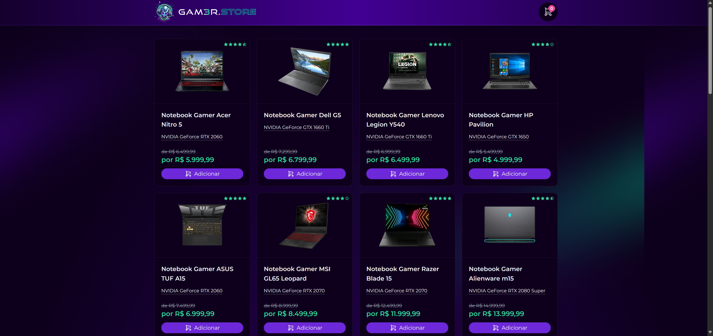

# Gam3r.store - FRONTEND
Frontend da Aplicação Gam3r.store feito durante a trilha intermediária da Formação DEV

<h1 align="center">
  
</h1>


<br>

## 💻 Tecnologias Utilizadas nesse Projeto
<div style="display: inline_block">
  
  
  
  
</div>

<br>

## Especificações
- Node: 20.17.0
- Pacote de Gerenciamento de Dependências: NPM
- Framework: NextJS

<br>

## Como instalar as dependências
```bash
$ npm install
```

## Rodar o Projeto
```bash
$ npm run dev
```
